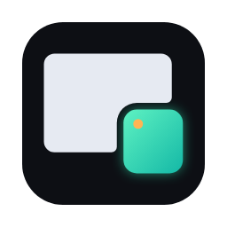

<p align="center"></p>

<h1 align="center">SidecarKeeper</h1>

<p align="center"><b>Auto-reconnect Apple Sidecar on macOS.</b><br>
Your iPad stays your second display. When Sidecar drops after sleep, lock or a closed lid,<br>
it comes back by itself, without a single "Unable to connect" notification.</p>

<p align="center">
  <a href="https://github.com/EMOEMOJAI/SidecarKeeper/actions/workflows/ci.yml"></a>
  <a href="https://github.com/EMOEMOJAI/SidecarKeeper/releases/latest"></a>
  
  <a href="LICENSE"></a>
</p>

<p align="center"></p>

## Install

Unlock your iPad, then paste this into Terminal:

```sh
/bin/bash -c "$(curl -fsSL https://github.com/EMOEMOJAI/SidecarKeeper/releases/latest/download/install.sh)"
```

That is the whole install. It needs nothing but macOS: no Xcode, no git, no `sudo`, no
permissions. It starts at login and needs no further attention.

Prefer Homebrew?

```sh
brew install emoemojai/tap/sidecarkeeper && brew services start sidecarkeeper
```

You can also download the release or build from source. All four routes, and exactly what
the installer does and trusts, are in the [install guide](docs/manual/install.md).

## Why

macOS drops [Sidecar](https://support.apple.com/en-us/102597) whenever the built-in display
turns off, and never reconnects it. The obvious fix, a script that calls "connect" in a
loop, makes things worse: while the Mac is locked the connect cannot succeed, and **every
failed attempt raises a notification**. Leave that running overnight and you wake up to a
hundred of them.

SidecarKeeper only tries when a connect can actually work:

| It checks that | So that |
| --- | --- |
| you have not paused it | a disconnect you chose stays disconnected |
| the screen is awake and the session is unlocked | nothing is attempted behind the lock screen |
| the lid is open | it never asks for something macOS cannot do |
| the iPad is reachable | an iPad in another room costs nothing |

After a real failure it backs off from 30 seconds to 5 minutes. A reconnect typically takes
5 to 9 seconds. [How it works](docs/manual/how-it-works.md) has the details.

## Use

```sh
sidecar-keeper status   # is it running, is it paused, what did it last do
sidecar-keeper pause    # you disconnected on purpose: stop reconnecting
sidecar-keeper resume   # start again
```

The log at `~/Library/Logs/sidecar-keeper.log` records every decision, one line per change.
Remove everything with `~/.sidecarkeeper/uninstall.sh`.

To pick a specific iPad, tune the timing, or force the USB cable, run
`sidecar-keeper config --init` and edit the settings file it creates. See
[configuration](docs/manual/configuration.md) and [wired mode](docs/manual/wired-mode.md).

## Honest limits

Two things are decided by macOS, and no tool can change them.

- **Sidecar drops when the built-in display turns off.** Display sleep, the lock screen and
  a closed lid all end the session. SidecarKeeper makes the reconnect automatic and fast.
- **No Sidecar with the lid closed.** macOS cannot create the virtual display while the
  built-in one is off. Open the lid and the iPad is back within seconds.

It relies on Apple's private `SidecarCore` framework, through
[SidecarLauncher](https://github.com/Ocasio-J/SidecarLauncher), so a macOS update could break
it. If that happens, connects fail and get logged, and nothing else on your Mac is affected.

## Questions

<details>
<summary><b>Does it need admin rights, Xcode, or special permissions?</b></summary>

No. It is a per-user LaunchAgent and two small binaries in `~/.sidecarkeeper`. It never asks
for `sudo`, needs no privacy permissions, and the release install needs no developer tools.
</details>

<details>
<summary><b>How do I stop the "Unable to connect to iPad" notifications?</b></summary>

Those come from connect attempts that were never going to succeed. SidecarKeeper checks
screen, lock, lid and device state first, and backs off after a real failure, so they stop.
</details>

<details>
<summary><b>How is this different from SidecarLauncher, a Shortcut, or an AppleScript?</b></summary>

[SidecarLauncher](https://github.com/Ocasio-J/SidecarLauncher) connects once when you run it,
and SidecarKeeper uses it for exactly that. Shortcuts and AppleScript click through Control
Centre and break with macOS updates. None of them watch the session or know when a connect
is safe to try. SidecarKeeper is the always-on layer that decides when to call connect.
</details>

<details>
<summary><b>Does it work over USB, or Wi-Fi only?</b></summary>

Both. By default macOS picks the transport, and an experimental
[wired mode](docs/manual/wired-mode.md) forces the cable.
</details>

<details>
<summary><b>Is it safe?</b></summary>

It is open source, makes no network requests at runtime, and collects nothing. Release
binaries are built by GitHub Actions from the tagged source, with a provenance record you can
verify. They are not notarized, because that needs a paid Apple developer account.
[SECURITY.md](SECURITY.md) says exactly what each install route trusts.
</details>

More in the [FAQ](docs/manual/faq.md), and a table of every log line in
[troubleshooting](docs/manual/troubleshooting.md).

## More

[Manual](docs/manual/README.md) · [Website](https://emoemojai.github.io/SidecarKeeper/) ·
[Changelog](CHANGELOG.md) · [Contributing](CONTRIBUTING.md) ·
[Development](docs/manual/development.md)

Used daily on macOS 27 on Apple silicon. CI builds, tests and installs it on macOS 14, 15
and 26, on Apple silicon and on a real Intel Mac.
Built on [SidecarLauncher](https://github.com/Ocasio-J/SidecarLauncher) by Jovany Ocasio.
MIT licensed. Not affiliated with Apple.
